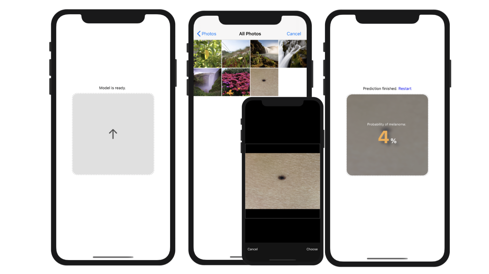

# mel-detect-poc

**mel**anoma **detect**ion **p**roof **o**f **c**oncept

## Description

This is a tutorial project for my article "[How to run AI models locally in a mobile device with React Native and Tensorflow.js](https://medium.com/@lin.xiang/how-to-run-ai-models-locally-in-the-smartphone-with-react-native-and-tensorflow-js-666f52fd15ca)". In this article my goal is to show how simple it is to integrate and run an AI model on the mobile device with React Native and Tensorflow.js.

The app here builds a simple user interface around an image classifier model which I took as an example and which is trained based on publicy accessable melanoma (skin cancer) images. The app asks the user to select an individual skin mole picture and returns the probability of this mole being a melanoma. The underlying AI model runs completely locally and contained in the mobile device.



You can find a more elaborated solution [here](https://github.com/RyanLinXiang/myskin) in my repos.

### Dependencies

```
package.json
```

### Installing

```
npm install
```

### Executing program

```
npm start
```

## Acknowledgments

* [HAM10000 dataset](https://dataverse.harvard.edu/dataset.xhtml?persistentId=doi:10.7910/DVN/DBW86T)
